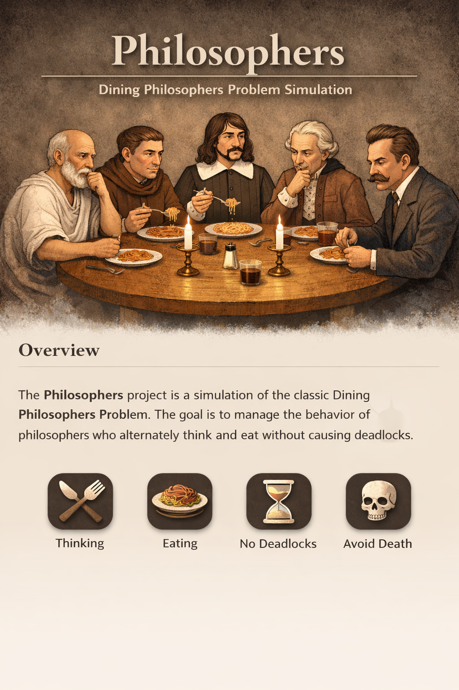

# Philosophers – 42 School Project

This repository contains my **Philosophers** project from 42 School. The project implements the classic **Dining Philosophers Problem**, teaching **multithreading, synchronization, and concurrent programming** in C.

---

## Overview

`Philosophers` simulates a number of philosophers sitting around a table, alternating between thinking and eating. Each philosopher needs two forks (shared resources) to eat, introducing challenges in **deadlock prevention** and **resource management**.

### Features

* Simulates **N philosophers** sitting around a table
* Philosophers alternate between **thinking, eating, and sleeping**
* Uses **mutexes** or **semaphores** to control fork access
* Implements proper **synchronization** to prevent deadlocks
* Tracks philosopher states and prints real-time actions
* Optional: monitors for philosopher death if they starve

### Installation & Build

```bash
git clone <repo-url>
cd philosophers  # change to the project directory
make
./philosophers <number_of_philosophers> <time_to_die> <time_to_eat> <time_to_sleep> [number_of_times_each_philosopher_must_eat]
```

### Usage

* Each philosopher attempts to pick up two forks to eat.
* Philosophers think when not eating, and sleep after eating.
* Monitor the output to see the real-time simulation of actions.

### Notes

* Focuses on **concurrent programming**, managing shared resources safely.
* Emphasizes **deadlock prevention**, proper use of mutexes/semaphores, and thread lifecycle management.
* Essential project for understanding **multithreading concepts** in C.

---

## Contributors

* @yourusername – 42 School

---

## Languages

* C — 92.9%
* Makefile — 7.1%
